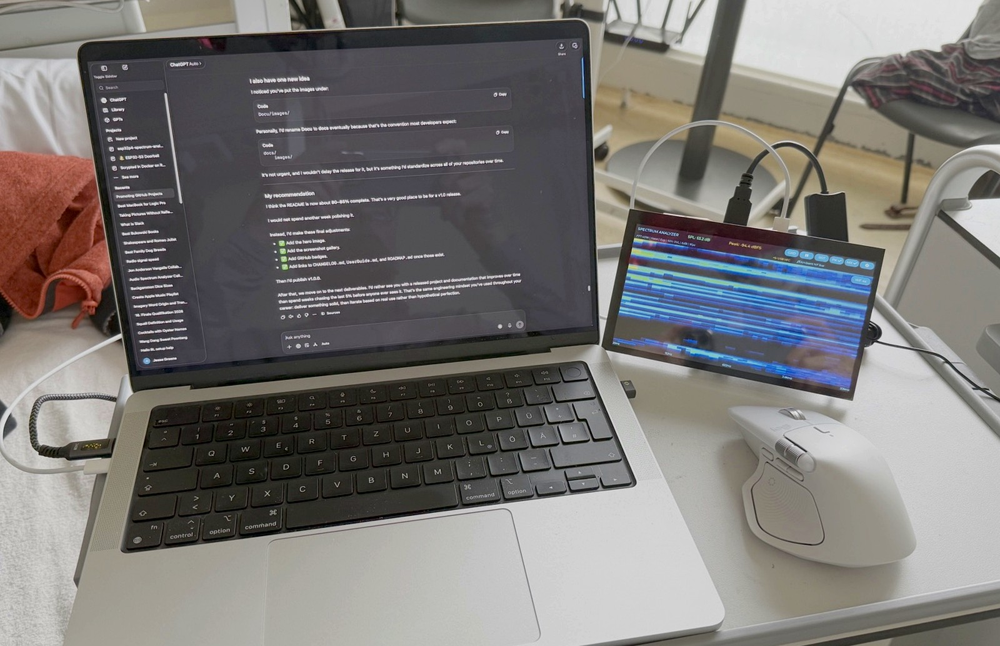

# ESP32-P4 Spectrum Analyzer


(Docu/images/hero-waterfall.jpg)
**A professional real-time audio measurement instrument for the ESP32-P4 Function EV Board.**


> **Status:** Stable Public Release – **v1.0.0**

---

## 🎬 See It In Action

The animation below was generated from the actual hardware demonstration video.

<p align="center">

</p>

A compressed MP4 version is also included here:

[Watch the demo video](Docu/images/demo-readme.mp4)

The animation demonstrates live spectrum analysis, waterfall display, oscilloscope mode, display mode switching and the touchscreen user interface.

---

## Documentation

| Document | Description |
|----------|-------------|
| [User Guide](Docu/UserGuide.md) | Operating the analyzer |
| [Roadmap](ROADMAP.md) | Planned future enhancements |
| [Release Notes](RELEASE_NOTES.md) | Latest release summary |
| [Changelog](CHANGELOG.md) | Version history |

---

## Why I Built This Project

The ESP32-P4 is a remarkably capable embedded platform, yet most audio examples stop at demonstrating individual peripherals or basic FFT processing.

The goal is to build a complete embedded audio measurement instrument that feels like a real piece of laboratory equipment rather than a technology demonstration.

It combines modern embedded graphics, DSP, USB Audio Class support, persistent configuration, touchscreen interaction and web-based configuration into a single standalone application.

Although it began as a personal engineering project, it is released as open source so that others can learn from it, improve it and build on it.

---

# Highlights

- Real-time FFT analysis (512–16384 point)
- Multiple window functions
- Multiple averaging modes
- Spectrum, Waterfall, Oscilloscope, Mirror, VU and 1/3 Octave displays
- USB Audio Class (UAC1) support
- ES8311 onboard audio support
- Runtime USB stereo-to-mono selection
- Touchscreen pinch zoom
- Microphone calibration support
- Noise-floor capture and subtraction
- Presets with full runtime persistence
- SD card configuration storage
- Wi-Fi provisioning
- Embedded web interface
- PlatformIO and ESP-IDF compatible

---

## User Interface

| Spectrum | Waterfall |
|----------|-----------|
|  |  |

| Oscilloscope | Line |
|--------------|------|
|  |  |

| Settings |
|-----------|
|  |

---

# What makes this project different?

Many embedded FFT projects answer the question:

> "Can an ESP32 perform an FFT?"

This project asks a different question:

> **"How capable can an ESP32-P4 become as a standalone audio measurement instrument?"**

Every feature is evaluated against one goal:

**Does it make the instrument more useful?**

---

# Feature Summary

| Capability | Status |
|------------|:------:|
| FFT Analyzer | ✅ |
| Oscilloscope | ✅ |
| Waterfall Display | ✅ |
| 1/3 Octave Analyzer | ✅ |
| USB Audio | ✅ |
| ES8311 Audio | ✅ |
| Touch Gestures | ✅ |
| Web Interface | ✅ |
| Presets | ✅ |
| Calibration | ✅ |
| Noise Floor Capture | ✅ |
| Wi-Fi Provisioning | ✅ |
| Distributed Stereo Analyzer | 🚧 Planned for v2.0 |

---

# Quick Start

## Hardware Required

- ESP32-P4 Function EV Board
- USB-C cable
- microSD card
- Optional USB UAC1 interface, such as the Behringer UCA222
- Optional calibrated USB measurement microphone

## Clone

```bash
git clone https://github.com/JFG3rd/JFG-ESP32-P4-Function-EV-Board-Spectrum-Analyzer.git
```

## Build with PlatformIO

```bash
pio run
pio run -t upload
```

## Build with ESP-IDF

```bash
idf.py build
idf.py flash
```

Insert the SD card and reboot.

---

# Typical Applications

The Spectrum Analyzer is suitable for loudspeaker development, audio amplifier analysis, AVR setup and testing, USB audio debugging, DSP development, educational demonstrations, embedded audio development and general frequency analysis.

---

# Supported Audio Sources

## On-board ES8311

Ideal for development and testing.

## USB Audio Class (UAC1)

Supports external USB audio interfaces.

Runtime options:

- Average L+R
- Left only
- Right only

No recompilation required.

---

# Display Modes

- Spectrum
- Waterfall
- Oscilloscope
- Mirror
- VU Meter
- 1/3 Octave

Most analyzer views support two-finger pinch zoom for frequency span and display range.

---

# Software Architecture

```text
                Audio Sources
      ┌────────────────────────────┐
      │ ES8311 │ USB Audio │ Future│
      └──────────────┬─────────────┘
                     │
                     ▼
              Audio Source Manager
                     │
                     ▼
                DSP Processing
         FFT │ Averaging │ Calibration
                     │
                     ▼
              Visualization Engine
      Spectrum │ Scope │ Waterfall │ VU
                     │
          ┌──────────┴──────────┐
          ▼                     ▼
      LCD Display          Web Interface
```

The firmware is intentionally organized into independent components including audio capture, DSP, networking, settings management and display rendering.

---

# Repository Structure

```text
components/
    audio_source/
    dsp_engine/
    display_ui/
    settings_mgr/
    net_mgr/
    web_server/

Docu/
    images/
    UserGuide.md

web/
include/
src/
```

---

# Roadmap

## Version 1.0 — Standalone Analyzer

- Complete embedded spectrum analyzer
- Multiple display modes
- USB Audio
- Touch interface
- Calibration
- Web interface

## Version 2.0 — Distributed Stereo Analyzer

Operate two ESP32-P4 analyzers as a synchronized pair.

Planned features include Primary / Secondary operating modes, stereo channel split, low latency PCM streaming, preset synchronization, automatic pairing, shared configuration and synchronized displays.

## Future Development

Potential future capabilities include transfer-function measurements, THD analysis, impulse response, data logging, CSV export, browser-based remote displays and additional display themes.

---

# Feedback

If you build the project, I would enjoy hearing about it.

Bug reports, suggestions and pull requests are welcome.

If the project proves useful, please consider giving it a ⭐ on GitHub to help others discover it.

---

## Project Background

This project began as a personal engineering challenge while I was undergoing treatment for acute myeloid leukemia (AML). During an extended hospital stay I wanted to continue learning, solving problems, and designing embedded systems.

Engineering has always been one of the ways I make sense of complex problems, and this project became an opportunity to keep learning while facing a very different kind of challenge.

What started as an exploration of the ESP32-P4 and real-time DSP gradually evolved into a much more capable audio measurement instrument. Every new feature was added with the same goal in mind: to build something genuinely useful rather than simply demonstrate a particular technology.

I am releasing the project as open source in the hope that other engineers, students, makers, and audio enthusiasts will find it useful, learn from it, and perhaps extend it in directions I never imagined.

---

# License

Apache 2.0
