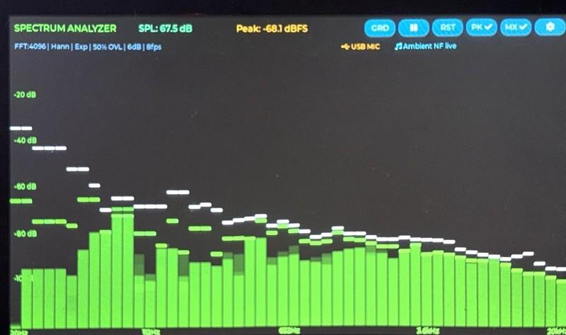
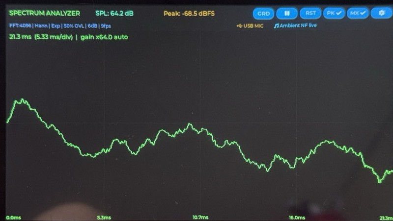
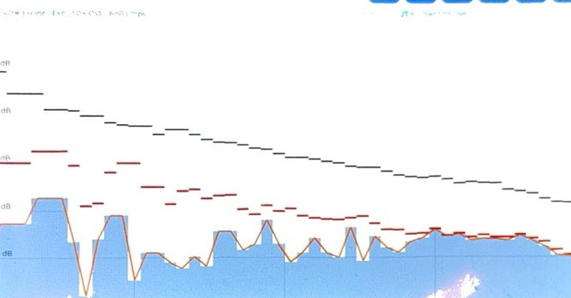
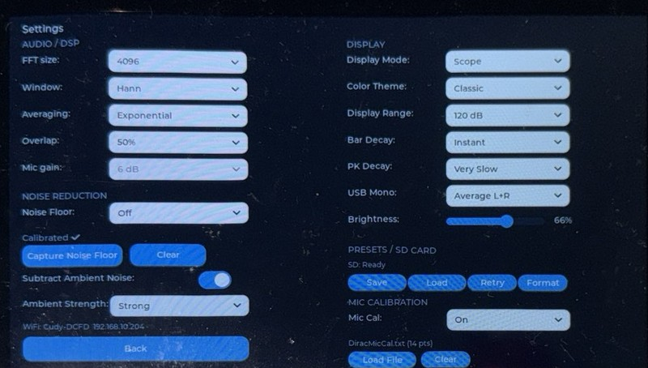

# SpectraLab-P4
### Professional real-time audio spectrum analyzer for the ESP32-P4 Function EV Board


> **SpectraLab-P4 — a professional real-time audio measurement instrument for the ESP32-P4 Function EV Board.**


> **Status:** Stable Public Release – **v1.3.0**

---

## 🎬 See It In Action

The animation below was generated from the actual hardware demonstration video.

<p align="center">

</p>

The animation demonstrates live spectrum analysis, waterfall display, oscilloscope mode, display mode switching and the touchscreen user interface.

---

# 🌐 Embedded Web Interface

The analyzer includes a fully integrated responsive web interface. No additional software is required—any modern browser on your local network can access the device.

Features include:

- Analyzer status dashboard
- Dark and Light themes
- Wi-Fi configuration
- Microphone calibration upload
- Remote configuration
- Browser-based operation

## Main Dashboard

<table>
<tr>
<td align="center"><strong>Dark Theme</strong></td>
<td align="center"><strong>Light Theme</strong></td>
</tr>
<tr>
<td></td>
<td></td>
</tr>
</table>

## Wi-Fi Configuration

<table>
<tr>
<td align="center"><strong>Dark Theme</strong></td>
<td align="center"><strong>Light Theme</strong></td>
</tr>
<tr>
<td></td>
<td></td>
</tr>
</table>

## Microphone Calibration

<table>
<tr>
<td align="center"><strong>Dark Theme</strong></td>
<td align="center"><strong>Light Theme</strong></td>
</tr>
<tr>
<td></td>
<td></td>
</tr>
</table>


## Documentation

| Document | Description |
|----------|-------------|
| [Quick Start](#quick-start) | Build and flash the analyzer |
| [Display Modes](#display-modes) | Supported on-device analyzer views |
| [Embedded Web Interface](#-embedded-web-interface) | Browser dashboard, Wi-Fi setup and calibration upload |
| [Roadmap](#roadmap) | Planned future enhancements |
| [Release Notes](https://github.com/JFG3rd/SpectraLab-P4/releases) | GitHub releases |
| [Changelog](CHANGELOG.md) | Version history, release-by-release |

---

## Why I Built This Project

This project began as a personal engineering challenge while I was undergoing treatment for acute myeloid leukemia (AML). During an extended hospital stay I wanted to continue learning, solving problems and building something real — work I could pick up and put down around treatment, and that would still be there when I came back to it.

Engineering has always been one of the ways I make sense of complex problems, and this project became an opportunity to keep learning while facing a very different kind of challenge.

The ESP32-P4 is a remarkably capable embedded platform, yet most audio examples stop at demonstrating individual peripherals or basic FFT processing. What started as an exploration of the ESP32-P4 and real-time DSP gradually evolved into a much more capable audio measurement instrument. Every new feature was added with the same goal in mind: to make it behave like a real piece of laboratory equipment rather than a technology demonstration.

It combines modern embedded graphics, DSP, USB Audio Class support, persistent configuration, touchscreen interaction and web-based configuration into a single standalone application.

I am releasing the project as open source in the hope that other engineers, students, makers, and audio enthusiasts will find it useful, learn from it, and perhaps extend it in directions I never anticipated.

---

# Highlights

- Real-time FFT analysis (512–16384 point)
- Multiple window functions
- Multiple averaging modes
- Spectrum, Waterfall, Oscilloscope, Mirror, VU and 1/3 Octave displays
- USB Audio Class (UAC1) support
- ES8311 onboard audio support
- Runtime USB stereo-to-mono selection
- Touchscreen pinch zoom
- Microphone calibration support
- Automatic Gain Control (AGC) with manual override
- Noise-floor capture and subtraction
- Presets with full runtime persistence
- Named settings profiles
- A-weighted SPL and mic sensitivity entry
- Peak readout cursor — long-press a peak for exact frequency, level, band and note
- Screenshot capture to SD card (PNG)
- SD card configuration storage
- Wi-Fi provisioning
- Multiple remembered Wi-Fi networks with automatic reconnect
- Embedded web interface
- Responsive browser interface
- Dark and Light themes
- Browser-based Wi-Fi configuration
- Browser-based microphone calibration upload
- Browser-based SD card file browser, downloads and screenshot capture
- Browser-based static IP configuration
- Remote analyzer configuration
- PlatformIO and ESP-IDF compatible

---

## User Interface

| Spectrum | Waterfall |
|----------|-----------|
|  |  |

| Oscilloscope | Line |
|--------------|------|
|  |  |

| Settings |
|-----------|
|  |

Touch drives everything. The one exception is the Wi-Fi QR scanner: the
camera and the touch controller share an I2C bus, so touch pauses while the
camera is live. Optional front-panel keycaps cover that gap and add a
hardware display-mode shortcut — see [hardware-setup.md](hardware-setup.md).

---

# What makes this project different?

Many embedded FFT projects answer the question:

> "Can an ESP32 perform an FFT?"

This project asks a different question:

> **"How capable can an ESP32-P4 become as a standalone audio measurement instrument?"**

Every feature is evaluated against one goal:

**Does it make the instrument more useful?**

---

# Feature Summary

| Capability | Status |
|------------|:------:|
| FFT Analyzer | ✅ |
| Oscilloscope | ✅ |
| Waterfall Display | ✅ |
| 1/3 Octave Analyzer | ✅ |
| USB Audio | ✅ |
| ES8311 Audio | ✅ |
| Touch Gestures | ✅ |
| Embedded Web UI | ✅ |
| Dark / Light Themes | ✅ |
| Wi-Fi Configuration | ✅ |
| Calibration Upload | ✅ |
| Remote Configuration | ✅ |
| Presets | ✅ |
| Calibration | ✅ |
| Noise Floor Capture | ✅ |
| Automatic Gain Control | ✅ |
| Wi-Fi Provisioning | ✅ |
| Multiple Saved Wi-Fi Networks | ✅ |
| Saved Network Management (view / forget) | ✅ |
| Static IP Configuration (device + browser) | ✅ |
| Named Settings Profiles | ✅ |
| A-Weighting / Mic Sensitivity | ✅ |
| Peak Readout Cursor | ✅ |
| Screenshot Capture (PNG to SD) | ✅ |
| SD File Browser & Download | ✅ |
| Camera QR Wi-Fi Setup | ✅ |
| Front-Panel Keycaps (optional) | ✅ |
| Distributed Stereo Analyzer | 🚧 Planned for v2.0 |

---

# Quick Start

## Hardware Required

- ESP32-P4 Function EV Board
- USB-C cable
- microSD card
- Optional USB UAC1 interface, such as the Behringer UCA222
- Optional calibrated USB measurement microphone
- Optional 1-2 x Seeed Grove-Mech Keycap — front-panel keys whose RGB LEDs
  show what each key selects: one cycles the colour theme (and cancels a
  camera QR scan while touch is suspended, or restarts the board on a 2 s
  hold), the other cycles the spectrum display mode (wiring in
  [hardware-setup.md](hardware-setup.md) — power them from 3V3, never 5V)

## Clone

```bash
git clone https://github.com/JFG3rd/SpectraLab-P4.git
```

## Build with PlatformIO

```bash
pio run
pio run -t upload
```

## Build with ESP-IDF

```bash
idf.py build
idf.py flash
```

Insert the SD card and reboot.

---

# Typical Applications

SpectraLab-P4 is suitable for loudspeaker development, audio amplifier analysis, AVR setup and testing, USB audio debugging, DSP development, educational demonstrations, embedded audio design, room acoustics and noise-floor measurement.

---

# Supported Audio Sources

## On-board ES8311

Ideal for development and testing.

## USB Audio Class (UAC1)

Supports external USB audio interfaces.

Runtime options:

- Average L+R
- Left only
- Right only

No recompilation required.

---

# Display Modes

Eight modes, cycled from the Settings screen or from the optional front-panel keycap:

- Bars — classic bar spectrum
- Line — filled line/area spectrum
- 1/3 Octave — 31-band RTA
- Persistence — phosphor-style ghost trails
- Waterfall — scrolling spectrogram
- Oscilloscope — raw waveform
- VU Meter — large SPL and peak readouts
- Mirror — bars growing from the vertical centre

Most analyzer views support two-finger pinch zoom for frequency span and display range.

---

# Software Architecture

```text
                Audio Sources
      ┌────────────────────────────┐
      │ ES8311 │ USB Audio │ Future│
      └──────────────┬─────────────┘
                     │
                     ▼
              Audio Source Manager
                     │
                     ▼
                DSP Processing
         FFT │ Averaging │ Calibration
                     │
                     ▼
              Visualization Engine
      Spectrum │ Scope │ Waterfall │ VU
                     │
          ┌──────────┴──────────┐
          ▼                     ▼
      LCD Display          Web Interface
```

The firmware is intentionally organized into independent components including audio capture, DSP, networking, settings management and display rendering.

---

# Repository Structure

```text
components/
    audio_source/     ES8311 I2S + USB UAC1 host, hot-swap
    dsp_engine/       FFT, windows, averaging, SPL, noise floor, calibration
    agc/              software automatic gain control
    display_ui/       LVGL 9 screens, screenshot capture
    settings_mgr/     SD + NVS persistence, presets, file listing
    net_mgr/          Wi-Fi join, setup AP, static IP, mDNS
    web_server/       HTTP portal, REST API, file browser
    qr_scan/          MIPI-CSI capture + QR decode for Wi-Fi provisioning
    panel_button/     optional Grove-Mech Keycaps

Docu/
    images/

web/                  browser assets (baked into web_server by tools/)
tools/
src/

UserGuide.md
hardware-setup.md
CHANGELOG.md
ROADMAP.md
```

---

# Roadmap

## Version 1.0 — Standalone Analyzer

- Complete embedded spectrum analyzer
- Multiple display modes
- USB Audio
- Touch interface
- Calibration
- Web interface

## Version 1.x — Usability & Provisioning

- ✅ Multiple remembered Wi-Fi networks with automatic reconnect to whichever known network is in range
- ✅ Robust on-device Wi-Fi scanning and provisioning, with a "Show password" toggle
- ✅ Per-device mDNS name (`spectralab-p4-xxxx.local`) so multiple units coexist on one network
- ✅ Camera QR-code Wi-Fi provisioning — point the on-board camera at a router's Wi-Fi QR code to auto-fill SSID/password from the on-device Wi-Fi setup flow
- ✅ QR scanner stability — real camera errors are shown instead of a bare "Scanner stopped", touch and audio survive a scan, the UI is never blocked while stopping, and an idle scan gives up after 45 s
- ✅ Optional front-panel Grove-Mech Keycaps — a colour-theme/scan-abort/restart key usable while touch is suspended for a camera scan, plus a display-mode key; each LED glows the colour of what its key currently selects

## Version 2.0 — Distributed Stereo Analyzer

Operate two ESP32-P4 analyzers as a synchronized pair.

Planned features include Primary / Secondary operating modes, stereo channel split, low latency PCM streaming, preset synchronization, automatic pairing, shared configuration and synchronized displays.

## Future Development

Potential future capabilities include transfer-function measurements, THD analysis, impulse response, data logging, CSV export, browser-based remote displays and additional display themes.

---

# Feedback

If you build the project, I would enjoy hearing about it.

Bug reports, suggestions and pull requests are welcome.

If the project proves useful, please consider giving it a ⭐ on GitHub to help others discover it.

---

# License

Apache 2.0
